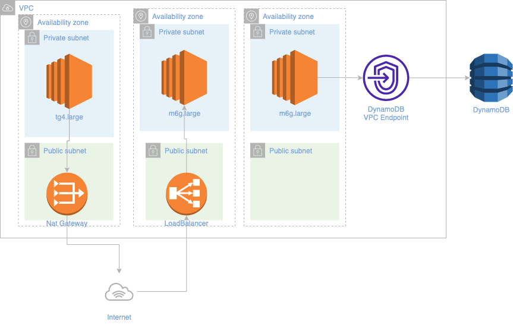

# helloworld API

Basic API written in golang that stores users with a username and date of birth and calculates the number of days until next birthday.

## Service Architecture

The overall architecture for this service, deployed on AWS:


The application runs on a kubernetes cluster on AWS (EKS) using the helm chart available on this repo. Inside the cluster, the pods will be autoscaled by an horizontal pod autoscaler (for now is configured to scale up just based on cpu by default) and is associated with a kubernetes service, in order to have incoming traffic. An Ingress resource is also available on the helm chart to be enabled. 
An NGINX Ingress Controller will also be running on the cluster to configure a Load Balancer that will route traffic into the kubernetes cluster. An [external dns](https://github.com/kubernetes-sigs/external-dns) controller will also be deployed in the cluster to update the route53 record with the Load Balancer URL automatically.
On the backend, the `helloworld` pods will interact with a table called `users` on DynamoDB. The permissions for the service to interact with the DynamodDB table are provided through a kubernetes ServiceAccount that is associated with a IAM Role that has permissions to store and retrieve items from the table. With the ServiceAccount, the service pods will be able to assume this role.

## Network Architecture

The network architecture for this service:


The service will be running on a managed node group running across 3 private subnets across 3 different azs. The communication with DynamoDB will be done through a vpc endpoint for better security and less cost. The Load balancer will be on a public subnet and then the outbount will go through a Nat Gateway since the spot instances are running on private subnets.

## Terraform

The terraform code that creates the required infrastructure to deploy the helloworld service is under the `terraform` folder.
It uses popular terraform modules such as [terraform blueprints](https://github.com/aws-ia/terraform-aws-eks-blueprints) and [aws vpc module](https://github.com/terraform-aws-modules/terraform-aws-vpc) and the plan/apply is executed on github actions.
The plan runs for every Pull Request and is shown as a comment on the PR so it can be reviewed and then applied after it is merged.

### ⚠️⚠️ Disclaimer ⚠️⚠️
The Terraform code was not tested 100% because the AWS account I used to do this exercise got suspended automatically by AWS and support (since I was creating/destroying resources multiple times and they detected suspicious activity). They didn't unblock it during the weekend and therefore I was not able to run the final apply.


## Artifacts

This repo is pushing both a docker image and a helm chart on every merge on the main branch, using github actions.

### Docker image

A docker image tagged with `latest` is pushed when a PR is merged to the main branch and also with the commit hash on every PullRequest. The docker images (for both arm64 and amd64 architectures) are publicly available at ghcr: https://github.com/ihopethisisfine/helloworld/pkgs/container/helloworld

### Helm chart

A helm chart to install this application to a kubernetes cluster is available at https://ihopethisisfine.github.io/helloworld.
It can be easily installed running `make deploy-chart` or running these:
```
helm repo add helloworld https://ihopethisisfine.github.io/helloworld
helm upgrade --install helloworld helloworld/helloworld
```

You can also deploy the local helm chart if you have local changes just by running `make deploy-local-chart`.

## Local development and testing

There is multiple options to run the api and dependencies locally on your environment.

Please make sure you have installed the following items before proceeding with the next steps:

* [Go 1.19+](https://golang.org/doc/install)
* [Docker](https://docs.docker.com/get-docker/)
* [Helm 3+](https://helm.sh/docs/intro/install/)
* [Minikube](https://minikube.sigs.k8s.io/docs/start/)
* [kubectl](https://kubernetes.io/docs/tasks/tools/install-kubectl-macos/)

### Makefile

This repo contains a `Makefile` to make your life easier. Type `make help` to see the different options available.
If you just want to run the application without any depencencies or docker required, just type `make run`.

### Docker compose

To run the docker containers for this repository with docker-compose you just need to:

1. Run `make compose-up` to launch the api and a docker container running dynamodb.
2. Test it with `curl localhost:8080/hello/asd -Lv -XPUT -d "{ \"dateOfBirth\": \"2020-02-29\" }"`
3. Run `make compose-down` when you're done.

### Helm chart with minikube

This repo contains a helm chart that can be deployed into minikube for local testing on a kubernetes cluster.
By default, using the available makefile it will also launch a dynamodb container on the same cluster.

1. Run `make minikube-setup`, to start minikube and load the docker image from previous step.
2. Run `make deploy-chart`, to deploy the API and dependencies to minikube using helm. After that you can also run `minikube service helloworld` to get a url to test the application.
3. (optional) Run `make deploy-test` to run an connection test with helm.

### Unit/Integration Tests

This repo contains unit and integration tests that can be executed by running `make test`.
The tests on the persistence layer requires `docker` to be installed since it is using [testcontainers](https://golang.testcontainers.org/).
